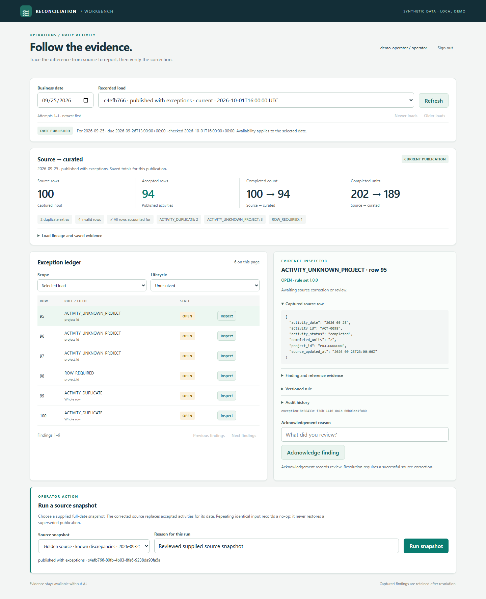
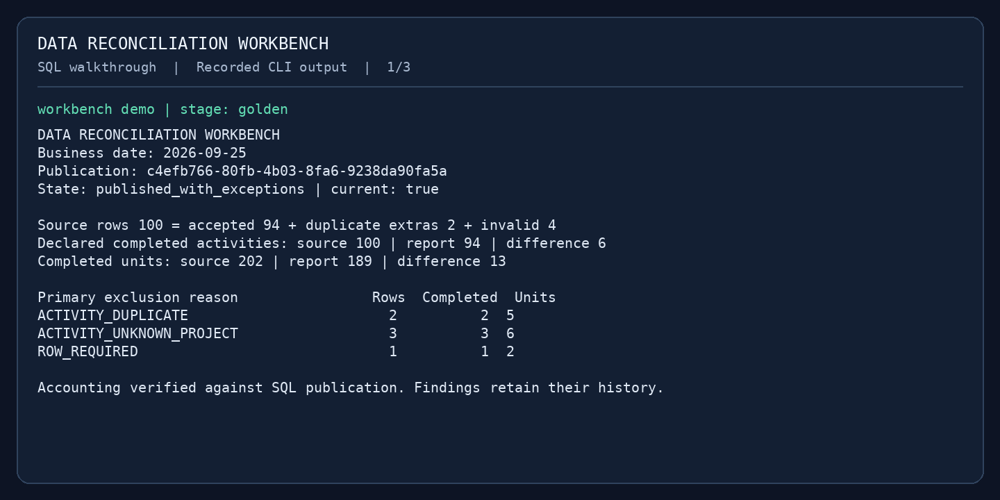

# Data Reconciliation Workbench

An operational workbench for investigating why a source export and a report disagree. Python and SQL Server perform validation and reconciliation. The screen saves investigations with cited evidence and versioned runbooks; optional AI adds explanatory notes. Offline guidance works without a provider. The earlier CLI assistant also has a reviewed live example.

The verified SQL demonstration follows **100 source rows → 94 accepted activities → 98/98 after source correction**. Every exclusion has a recorded reason, and repeating a successful load leaves counts unchanged.

## Watch the demonstration

[](docs/images/p07-preview/walkthrough.gif)

**[Watch the 25-second workbench preview](docs/images/p07-preview/walkthrough.gif)** — actual Chromium screenshots of the P07 screen, using saved P05 facts and an explicit in-memory service with simulated lifecycle states. This preview is a paced screenshot replay, not live SQL proof. [Capture provenance](docs/evidence/p07/README.md) and the [screen setup guide](docs/workbench-ui.md) explain how to reproduce it. P07 CI is user-confirmed green; its live capture artifacts have not yet been retained or inspected here.

Inspect the [corrected result](docs/images/p07-preview/03-corrected.png) and [retained exception history](docs/images/p07-preview/04-resolved.png). The accepted SQL CLI demonstration follows below.

[](docs/images/p05/walkthrough.gif)

**[Watch the 33-second SQL walkthrough](docs/images/p05/walkthrough.gif)** — actual CLI output from [successful P05 CI run 36637726571](https://github.com/BillMath2/data-reconciliation-workbench/actions/runs/36637726571), rendered as terminal captures with reading pauses. It shows the discrepancy, corrected source, and unchanged rerun. [Recording provenance](docs/evidence/p05/provenance.json) records the commit, supplied artifact links, and file hashes. This is a paced output replay, not desktop video.

| Recorded stage | Verified result |
|---|---|
| [Discrepancy](docs/images/p05/step-1.png) | 100 source rows, 94 accepted; two duplicates, three unknown projects, and one missing project ID explain all six exclusions |
| [Source correction](docs/images/p05/step-2.png) | Source and report agree: 98 completed activities and 197 units |
| [Identical rerun](docs/images/p05/step-3.png) | No-op; the same publication and totals are reused |

Inspect the [saved evidence and terminal recording](docs/evidence/p05/README.md), reproduce the [demo commands](docs/reconciliation.md#record-the-sql-walkthrough), or follow the [demonstration guide](docs/demo-guide.md).

## Project status

**P01-P08, including P05A, are complete; P09 is implemented locally with SQL CI acceptance pending.** On October 2, 2026, the user confirmed all runs after P03 green, including P08 commit `c7776e8`; exact P08 run artifacts have not been inspected here. P09 adds saved screen investigations, frozen citations, selected runbooks, and offline/live explanation modes. See [P09 validation](docs/p09-validation.md) for local results and the remaining gate; [P08 validation](docs/p08-validation.md) retains the earlier checkpoint.

**P09 local SQL verification: [338 tests passed](docs/evidence/p09-local/sql-checks.txt), including all 52 SQL cases with no skips.** Migration 008, repeatable setup, the reconciliation demo, API checks, and the complete browser workflow passed against Docker-hosted SQL Server on October 2, 2026. [Local evidence and provenance](docs/evidence/p09-local/README.md) are retained separately from the pending GitHub CI result. No live AI call was made.

**Verified P05 SQL suite: [164 tests passed](docs/evidence/p05/sql-checks.txt), including all 38 SQL cases, with no skips.** Both CI jobs were confirmed green; the downloaded artifacts were reviewed on October 1, 2026. See [P05 validation](docs/p05-validation.md) for provenance and checks, and [P04 verification](docs/p04-validation.md) for the earlier baseline.

## Explain the discrepancy

[Read the reviewed live AI explanation](docs/evidence/p05a/live.txt) alongside its [saved SQL evidence](docs/evidence/p05/golden-evidence.json), or try the explicitly labeled offline stub without SQL or an API key:

```powershell
.\scripts\uv.ps1 run --locked workbench explain --packet docs/evidence/p05/golden-evidence.json --provider stub --format text
```

Code checks the answer's structured counts and citations. The assistant has no database credentials, tools, or repair path; when AI is unavailable, deterministic evidence and guidance remain visible. Live prose still requires review. See the [assistant guide](docs/assistant.md) for setup and limits, and [P05A validation](docs/p05a-validation.md) for the single accepted example and tests. P05A local suite at that checkpoint: **158 passed, 38 SQL tests skipped**; the user confirmed the expanded P05A CI run green for commit `59091f3`. The verified P05 SQL baseline above remains distinct.

## Inspect evidence through the API

P06 adds authenticated report/evidence inspection and operator acknowledgement, with resolution linked to successful source correction. The API exposes the original saved packets and keeps lifecycle state separate. P07 adds the [operator screen at localhost:8000](docs/workbench-ui.md), server-clock freshness, and operator-only runs of the two supplied source snapshots. See the [API setup and endpoint guide](docs/evidence-api.md).

P08's **Who ran this load?** panel shows the selected attempt's actor, reason, and audit events, including separate failed and no-op attempts. Both roles can inspect it. Ingestion and acknowledgement remain operator-only. See the [role and audit guide](docs/permissions-audit.md).

P09's **Explain this evidence** panel lets both roles save an investigation of a selected publication or finding. Facts are deterministic; notes cite the frozen evidence and selected runbooks. Reopening an investigation after source correction preserves what it showed at capture time. Start with offline guidance; live AI requires explicit server configuration and user selection. Apply migration 008 and rebuild the API before using it. See the [investigation guide](docs/investigations.md).

## Run the foundation with Docker Compose

Use an x86-64 Docker host with Linux containers and Compose v2 or later. On Windows, Docker Desktop provides this environment. No native Python or SQL Server installation is required for this path.

From PowerShell in the repository:

```powershell
.\scripts\initialize-demo.ps1
docker compose --env-file .env.workbench up -d --wait --wait-timeout 240 sqlserver
docker compose --env-file .env.workbench build workbench
docker compose --env-file .env.workbench --profile tools run --build --rm migrate
docker compose --env-file .env.workbench run --rm workbench health
docker compose --env-file .env.workbench run --rm workbench db-smoke
docker compose --env-file .env.workbench --profile test run --build --rm tests
docker compose --env-file .env.workbench down
```

The setup script creates or upgrades `.env.workbench` with distinct generated administrator and runtime passwords, preserving existing nonempty credentials. On other platforms, copy `.env.example` to `.env.workbench` and set both passwords to different strong values (16-128 characters for the runtime password) before running the same Docker commands.

The `migrate` service creates the `workbench` database, applies pending migrations, and provisions the restricted `workbench_app` login. Rerunning it leaves applied migrations unchanged. The regular `workbench` service uses that runtime login. See the [schema and migration guide](docs/database-schema.md).

The database uses a named volume and stays inside the Compose network. `down` stops containers and preserves that volume. SQL tests create and remove their own uniquely named disposable databases and start the mock registry. Setup leaves the application tables empty; follow the [screen guide](docs/workbench-ui.md) to seed reference sources and start the workbench, or use the [CLI ingestion guide](docs/ingestion.md). The Compose file accepts Microsoft's SQL Server Developer EULA for development use.

## Inspect the synthetic sources

```powershell
.\scripts\uv.ps1 sync --locked --python 3.12
.\scripts\uv.ps1 run --locked workbench-fixtures --check fixtures/generated
.\scripts\uv.ps1 run --locked workbench-registry
```

The registry serves `http://127.0.0.1:8001/projects` with stable pagination. For the container version, use `docker compose --env-file .env.workbench --profile sources up -d --build --wait mock-registry`.

The [source-contract guide](docs/source-contracts.md) documents field ownership, manifests, fixture regeneration, the SQL seed, and S01-S12 scenario inputs. [Independent golden expectations](fixtures/expected/golden.json) specify the six excluded rows and expected totals. P04's SQL tests verified 94 accepted rows/189 units, then 98 rows/197 units after correction. P05 adds persisted reconciliation and the [read-only report/evidence commands](docs/reconciliation.md).

## Engineering evidence

- **Docker:** separate runtime/test image targets, a non-root Python process, a pinned SQL Server image, readiness checks, private database networking, and persistent storage.
- **SQL engineering:** twelve tables and three reporting views, source-row lineage, saved findings/reconciliation/investigations, atomic publication, an applied-version ledger, and a restricted runtime role. P06-P08 are accepted on user-confirmed green CI; P09's investigation migration 008 awaits SQL CI acceptance.
- **Automation:** GitHub Actions builds the images, tests real SQL Server, and captures the guided SQL demo with its evidence packets and media. P07 adds browser verification and a separate `ui-demo` artifact.
- **Reproducibility:** uv lockfile, explicit configuration, synthetic-data scope, and a Docker build context that excludes credentials.

See the [implementation plan](docs/implementation-plan.md) for the remaining work, [development setup](docs/development.md) for tooling and troubleshooting, and [demonstration guide](docs/demo-guide.md) for the README/screenshot/recording sequence.
