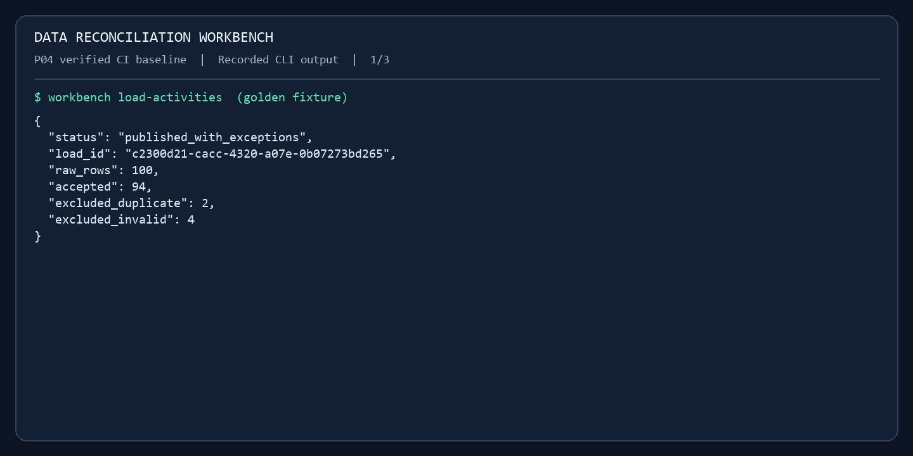

# Data Reconciliation Workbench

An operational workbench for investigating why a source export and a report disagree. Python and SQL Server perform validation and reconciliation. An optional AI explanation layer is planned next.

The planned demonstration follows **100 source rows → 94 accepted activities → 98/98 after source correction**. Every exclusion has a recorded reason, and repeating a successful load leaves counts unchanged.

## Watch the demonstration

[](docs/images/p04-baseline/walkthrough.gif)

**[Watch the 33-second SQL baseline replay](docs/images/p04-baseline/walkthrough.gif)** — actual CLI output from the successful P04 CI run, rendered as terminal captures with reading pauses. It shows the discrepancy, an unchanged rerun, and the passing SQL test suite. [Recording provenance](docs/images/p04-baseline/recording.json) identifies the run and commit. This is a paced output replay, not desktop video.

P05's expanded walkthrough records **100/94 → corrected 98/98 → no-op**, including unit totals and saved evidence. Its new SQL run is pending; CI will upload the complete recording and images as `sql-demo`. See the [demo commands](docs/reconciliation.md#record-the-sql-walkthrough) and [demonstration guide](docs/demo-guide.md).

## Project status

**P01-P04 are complete; P05 is implemented locally and awaits SQL verification.** The new reconciliation report groups exclusions by their primary reason, preserves unknown totals, and saves a bounded evidence packet with each publication. Historical reports survive source correction. AI integration and the workbench screen remain planned.

**Verified SQL baseline: [143 tests passed](https://github.com/BillMath2/data-reconciliation-workbench/actions/runs/36575474984), including all 33 SQL cases.** This validates P03's correction and P04's ingestion/publication behavior. **Current P05 local checks: 126 passed; 38 SQL tests skipped.** See [P04 verification](docs/p04-validation.md) and [P05 validation](docs/p05-validation.md).

## Run the foundation with Docker Compose

Use an x86-64 Docker host with Linux containers and Compose v2 or later. On Windows, Docker Desktop provides this environment. No native Python or SQL Server installation is required for this path.

From PowerShell in the repository:

```powershell
.\scripts\initialize-demo.ps1
docker compose --env-file .env.workbench up -d --wait --wait-timeout 240 sqlserver
docker compose --env-file .env.workbench build workbench
docker compose --env-file .env.workbench --profile tools run --build --rm migrate
docker compose --env-file .env.workbench run --rm workbench health
docker compose --env-file .env.workbench run --rm workbench db-smoke
docker compose --env-file .env.workbench --profile test run --build --rm tests
docker compose --env-file .env.workbench down
```

The setup script creates or upgrades `.env.workbench` with distinct generated administrator and runtime passwords, preserving existing nonempty credentials. On other platforms, copy `.env.example` to `.env.workbench` and set both passwords to different strong values (16-128 characters for the runtime password) before running the same Docker commands.

The `migrate` service creates the `workbench` database, applies pending migrations, and provisions the restricted `workbench_app` login. Rerunning it leaves applied migrations unchanged. The regular `workbench` service uses that runtime login. See the [schema and migration guide](docs/database-schema.md).

The database uses a named volume and stays inside the Compose network. `down` stops containers and preserves that volume. SQL tests create and remove their own uniquely named disposable databases and start the mock registry. Setup leaves the application tables empty; follow the [ingestion guide](docs/ingestion.md) to seed and load them. There is no workbench screen yet. The Compose file accepts Microsoft's SQL Server Developer EULA for development use.

## Inspect the synthetic sources

```powershell
.\scripts\uv.ps1 sync --locked --python 3.12
.\scripts\uv.ps1 run --locked workbench-fixtures --check fixtures/generated
.\scripts\uv.ps1 run --locked workbench-registry
```

The registry serves `http://127.0.0.1:8001/projects` with stable pagination. For the container version, use `docker compose --env-file .env.workbench --profile sources up -d --build --wait mock-registry`.

The [source-contract guide](docs/source-contracts.md) documents field ownership, manifests, fixture regeneration, the SQL seed, and S01-S12 scenario inputs. [Independent golden expectations](fixtures/expected/golden.json) specify the six excluded rows and expected totals. P04's SQL tests verified 94 accepted rows/189 units, then 98 rows/197 units after correction. P05 adds persisted reconciliation and the [read-only report/evidence commands](docs/reconciliation.md).

## Engineering evidence

- **Docker:** separate runtime/test image targets, a non-root Python process, a pinned SQL Server image, readiness checks, private database networking, and persistent storage.
- **SQL engineering:** eleven tables and two reporting views, source-row lineage, saved findings/reconciliation, atomic publication, an applied-version ledger, and a restricted runtime role. P05's new schema and rollback checks await CI.
- **Automation:** GitHub Actions builds the images, tests real SQL Server, and captures the guided SQL demo with its evidence packets and media.
- **Reproducibility:** uv lockfile, explicit configuration, synthetic-data scope, and a Docker build context that excludes credentials.

See the [implementation plan](docs/implementation-plan.md) for the remaining work, [development setup](docs/development.md) for tooling and troubleshooting, and [demonstration guide](docs/demo-guide.md) for the README/screenshot/recording sequence.
