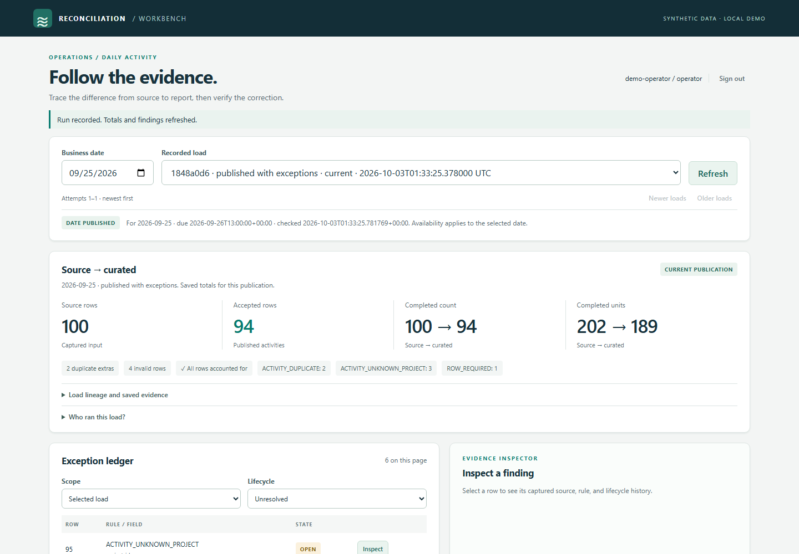
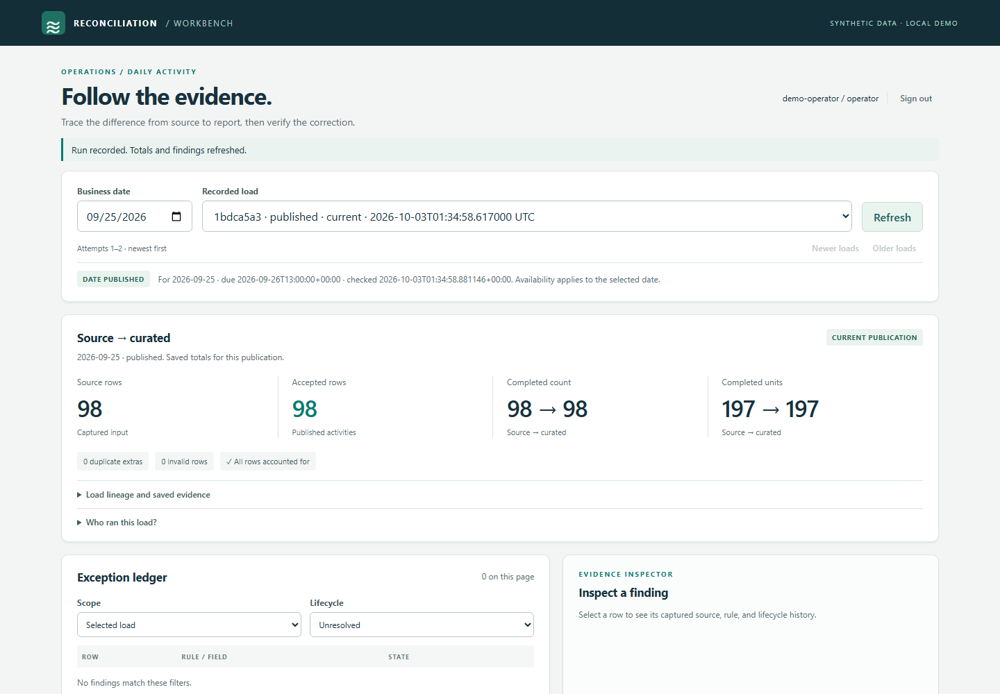
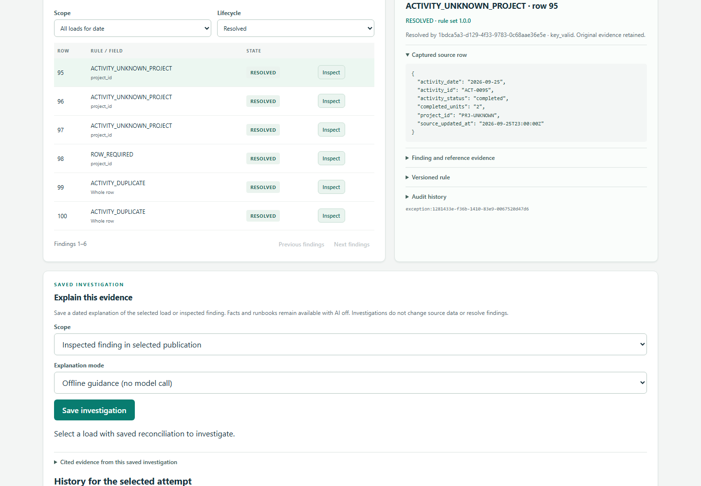
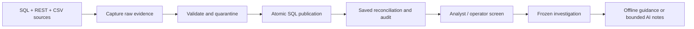

# Data Reconciliation Workbench

**Why does the source say 100 completed activities while the report shows 94?**
This workbench traces the difference to captured rows and validation rules, then
verifies a source correction without erasing original evidence. Python and SQL
Server perform the accounting; an analyst/operator screen exposes findings,
audit history, and frozen investigations. Optional AI explains supplied evidence.

## Watch the SQL-backed walkthrough

[](docs/images/p12/walkthrough.mp4)

**[Watch or download the 6:18 narrated walkthrough](docs/images/p12/walkthrough.mp4)**
([voice sample](docs/images/p12/voice-preview.mp3), [chapter player](docs/images/p12/index.html), [captions](docs/images/p12/captions.vtt),
[transcript](docs/release-narration.json)). GitHub may offer a download rather than
inline playback. The [demo guide](docs/demo-guide.md) explains local playback and replay.

Actual Chromium actions run against a fresh, isolated SQL Server stack. Narration
is the synthetic female British English Cori voice, not Bill's voice. The screen uses
labeled offline guidance; a separate chapter shows the reviewed, archived P05A
live AI response. No new model call occurs. [Capture provenance](docs/evidence/p12/README.md)
distinguishes the browser journey from historical AI/recovery exhibits.

| Stage | Verified behavior |
|---|---|
| Original snapshot | 100 rows to 94 accepted; two duplicate copies, three unknown projects, one missing project ID |
| Exact accounting | 202 declared completed units to 189 accepted; all six excluded rows accounted for |
| Source correction | 98 source/accepted activities and 197 source/accepted units; atomic date replacement |
| Identical retry | Audited no-op referencing the successful publication; no duplicated facts/findings |
| History | Original source and investigations stay frozen; six findings point to the correcting load |





## How it works



Each field has one authoritative source. Successful evaluation identities make
retries safe; correction replaces one business-date partition and keeps history.
The assistant has no database credentials or repair tools. Evidence and
deterministic guidance remain usable with AI disabled.

Read the [architecture](docs/architecture.md), [schema diagram](docs/database-schema.md),
[field dictionary](docs/data-dictionary.md), and [source contracts](docs/source-contracts.md).

## Verification and release status

P01-P09, including P05A, and P11 have user-confirmed green CI checkpoints.
P10 CI is green, but **expanded live-model evaluation and human semantic review
remain open**. P12's local demonstration/documentation package is ready for review;
the user confirmed P12 CI green for `d69b176`. The subsequent voice update awaits its own CI check. Full expanded-assistant release is not accepted.

- [P12 fresh replay](docs/p12-validation.md): nine migrations, unchanged repeat
  setup, driver checks, real SQL CLI/browser workflows, recording, and isolated cleanup.
- [P11 full SQL suite](docs/evidence/p11/sql-checks.txt): 386 passed, including
  all 64 SQL cases without skips. Six abrupt-exit rehearsals and actual backup/restore passed.
- [Measured SQL tuning](docs/sql-performance.md): selected query on 100,000
  activities/findings reduced logical reads from 2,718 to 6 with identical results.
  This is not a whole-application latency or throughput claim.
- [Reviewed P05A live explanation](docs/evidence/p05a/live.txt) and
  [P10 evaluation boundaries](docs/p10-validation.md) keep the accepted example
  separate from the outstanding expanded evaluation.

This is a local synthetic-data demo with one admitted worker and fixed references.
Enterprise SSO, tenant isolation, deployment, retention, and offsite recovery
remain outside scope. See [limits and remaining gates](docs/release-scope.md).

## Run locally with Docker Compose

Use an x86-64 Docker host with Linux containers. On Windows, Docker Desktop with
WSL 2 supplies that environment. SQL runs in the container; no native SQL Server
installation is required. Compose accepts the SQL Server Developer EULA for development.

From PowerShell in the repository:

```powershell
.\scripts\initialize-demo.ps1
docker compose --env-file .env.workbench up -d --wait --wait-timeout 240 sqlserver
docker compose --env-file .env.workbench --profile tools run --build --rm migrate
docker compose --env-file .env.workbench --profile sources up -d --build --wait mock-registry
docker compose --env-file .env.workbench build workbench
docker compose --env-file .env.workbench --profile tools run --rm migrate seed-departments
$referenceHash = (Get-Content fixtures/generated/index.json -Raw | ConvertFrom-Json).reference_sets.default
docker compose --env-file .env.workbench run --rm workbench load-departments --reference-hash $referenceHash
docker compose --env-file .env.workbench run --rm workbench load-projects
docker compose --env-file .env.workbench --profile web up -d --build --wait api
```

Open **http://127.0.0.1:8000/**. Read the ignored `.env.workbench` locally and use
`WB_DEMO_OPERATOR_TOKEN` to sign in. Choose September 25, 2026, run **Golden source**
with a reason, inspect a finding, then run **Corrected source**. The analyst token
allows inspection/investigations without ingestion or acknowledgement rights.
Never commit or capture token values. See the [screen guide](docs/workbench-ui.md).

Initialization preserves existing credentials. On other platforms, copy
`.env.example` to `.env.workbench`, set different strong SQL administrator/runtime
passwords and distinct demo tokens, then use the same Compose commands; obtain the
reference hash from `fixtures/generated/index.json`. Setup applies pending migrations
and verifies the restricted runtime login. SQL stays on the internal network;
the API host port is localhost-only.

An existing completed demo reuses prior publications. Inspect history or use the
[isolated release replay](docs/demo-guide.md) for a new demonstration. Stop normally
with `docker compose --env-file .env.workbench down`; this preserves the SQL volume.
Do not remove the volume to reset a demonstration.

## Test and investigate

```powershell
docker compose --env-file .env.workbench run --rm workbench health
docker compose --env-file .env.workbench run --rm workbench db-smoke
docker compose --env-file .env.workbench --profile test run --build --rm tests --run-sql
```

SQL tests use disposable databases. Host-only pytest reports SQL tests as skipped.
CI verifies the complete browser workflow and offline AI evaluation without paid
provider calls. [Development setup](docs/development.md) covers uv/Python, lint,
fixtures, and browser tooling.

Use the [operator runbook](docs/operations-runbook.md), [recovery/restore runbook](docs/recovery-runbook.md),
[permissions and audit](docs/permissions-audit.md), [investigation guide](docs/investigations.md),
and [API guide](docs/evidence-api.md). The [implementation plan](docs/implementation-plan.md)
records milestone acceptance; [earlier P05 CI evidence](docs/evidence/p05/README.md)
remains available for provenance.
