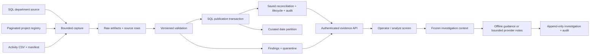

# Architecture and trust boundaries

The workbench answers a narrow operational question: which captured rows and
rules explain the difference between a source snapshot and a published report?
The sources and identities are synthetic. SQL and Python decide publication and
accounting; optional model notes explain supplied evidence.

## Data and transaction boundaries

Capture commits the original bytes and metadata before validation. Staging keeps
every accepted or excluded row and its primary accounting disposition. Multiple
findings on one row do not multiply the excluded-row count. Publication replaces
one activity date, saves reconciliation, closes only provably resolved historical
findings, and writes the audit event in one SQL transaction.

The evaluation key includes payload and manifest semantics, reference identity,
and contract/rule versions. A successful identity remains reserved after its
publication is superseded. Thus an identical retry is a recorded no-op, and
replaying old input does not undo a newer publication. A session application
lock admits one ingestion/recovery operation at a time. This is not a queue or
multi-worker processing system.

SQL constraints enforce grain, foreign keys, valid activity statuses/units, and
publication identity. The application establishes validation and reconciliation
semantics; constraints alone do not prove that a staged row was correctly validated.
See the [schema](database-schema.md), [dictionary](data-dictionary.md), and
[recovery runbook](recovery-runbook.md).

## Identity and application boundary

Compose keeps SQL on its internal network. The API binds only to localhost on
the host. Setup/migration uses an administrator connection; normal application
work uses `workbench_app`, with no DDL, backup, restore, or audit deletion grants.
Demo tokens establish expiring server sessions and fixed analyst/operator actors.
Mutations require same-origin and CSRF checks. Operators can run approved fixture
snapshots and acknowledge findings; both roles can inspect and save investigations.
Paths, SQL, model names, and arbitrary source URLs are not browser mutation inputs.

These controls are demonstrated locally; there is no enterprise SSO, tenant
boundary, production deployment, or generalized authorization policy. See
[permissions and audit](permissions-audit.md).

## Assistant boundary

Investigations freeze the saved packet, a dated observation, selected finding,
related captured records, and rule-selected runbooks. Counts are rendered by
code. The provider receives this bounded context with source text explicitly
untrusted; it has no database credentials or action tools. One request, no
automatic retries, timeout/output/cost limits, citation membership checks, and
safe fallback constrain the optional notes. The original evidence works offline.

Citation membership is not semantic proof. The first golden CLI example was
reviewed in P05A; expanded live scenario evaluation and human causal review remain
open in P10. Failed loads without reconciliation and missing dates stay in the
deterministic inspector rather than receiving invented model evidence.

## Reproducibility and delivery

Pinned SQL/container tooling, a uv lockfile, fixed fixtures, numbered migrations,
real SQL tests, and browser checks support local replay. P12's release script
creates a uniquely named Compose project with a fresh volume and separate ports;
its cleanup targets only that project. The recording uses genuine SQL-backed
browser actions, locally synthesized narration, and clearly labeled historical
AI/recovery exhibits. No paid provider call is part of CI or the release replay.
