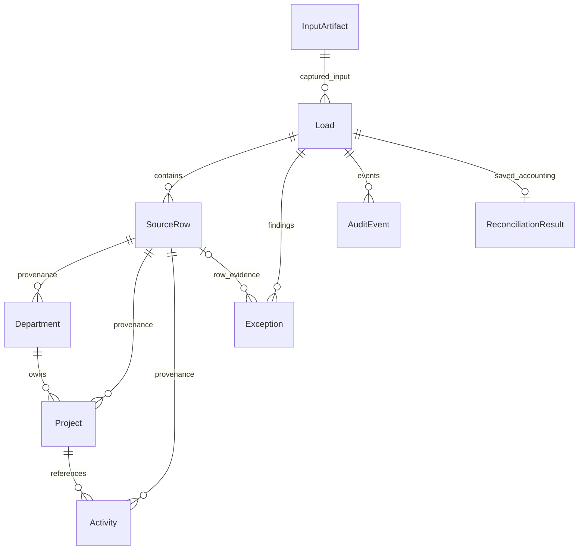

# Database schema and migrations

The current schema has eleven tables, seven migrations, and three reporting views. P03-P05 are verified in CI. P05 adds `ops.ReconciliationResult`, `report.vw_LoadReconciliation`, and `report.vw_ProjectActivity` in migration 006; these changes passed the P05 SQL run (164 tests, including all 38 SQL cases). See [reconciliation semantics](reconciliation.md), [P04 verification](p04-validation.md), and [P05 validation](p05-validation.md). P06 adds lifecycle columns and `report.vw_OpenExceptions` in migration 007; these await SQL acceptance. Original finding evidence stays immutable, and runtime UPDATE permission is limited to lifecycle columns. See [API/lifecycle semantics](evidence-api.md) and [P06 validation](p06-validation.md). Investigation storage remains later work.

## Initial tables

| Table | Key and important fields | Responsibility |
|---|---|---|
| `meta.SchemaMigration` | Version PK, unique filename, UTC applied time, original login | Applied-version ledger, created by the runner before migration 001 |
| `source.Department` | Department ID PK; name and active flag | Authoritative synthetic SQL input; compatible with P02's seed |
| `ops.InputArtifact` | UUID PK; source ID, SHA-256, raw bytes, JSON metadata, UTC captured time | Preserve exact captured input; runtime can insert/read but cannot update/delete |
| `ops.Load` | UUID PK; source/date, artifact FK, contract/rule versions, reference hash, evaluation key, status/times, actor, previous/reused load links | One row per attempt; retain failed, superseded, and no-op attempts |
| `stg.SourceRow` | `(load_id, row_ordinal)` PK; source, raw JSON, SHA-256, disposition, primary rule | Captured row envelope and one accounting disposition per row |
| `core.Department` | Department ID PK; name/active, originating load/ordinal | Current curated department |
| `core.Project` | Project ID PK; department FK, name/status, UTC updated time, originating load/ordinal | Current curated project |
| `core.Activity` | `(activity_date, activity_id)` PK; project FK, status/units, UTC source update, originating load/ordinal | Current activity partition per business date |
| `ops.Exception` | UUID PK; load/optional staged-row FKs, rule/version, field, evidence JSON, UTC created time | All row and load findings; lifecycle fields arrive in P06 |
| `ops.AuditEvent` | UUID PK; load FK, actor, action, details JSON, UTC event time | Append-only application event history |
| `ops.ReconciliationResult` | Load PK/FK; calculation version, BIGINT counts/units, summary and bounded evidence JSON | Immutable publication-time reconciliation; unknown source units are NULL |

The typed definitions begin in [001_capture.sql](../sql/migrations/001_capture.sql) and [002_curated.sql](../sql/migrations/002_curated.sql), with corrections in [004](../sql/migrations/004_identifier_checks.sql) and evidence additions in [005](../sql/migrations/005_ingestion_evidence.sql). Field ownership and normalization are specified in the [source contracts](source-contracts.md). Curated IDs are uppercase ASCII, at most 16 characters; names are Unicode and at most 100 UTF-16 code units. Curated source timestamps use `DATETIME2(0)` and must be supplied in UTC. Operational timestamps use UTC `DATETIME2(3)`. `ops.Load.attempt_number` is an identity used to order attempts without timestamp ties.



The diagram shows the nine pipeline/evidence tables. `source.Department` is the simulated input, not the curated department table; `meta.SchemaMigration` is independent deployment metadata. A load may exist without an artifact when capture fails. Findings can apply to a whole load or a staged row.

## Constraints and publication boundary

Composite foreign keys carry the source ID through artifact, load, staged row, and curated provenance. An activity cannot point at a department source row. Project/department and activity/project FKs reject missing curated parents. Activity checks enforce positive units for completed work and zero for planned/cancelled work. The SQL tests exercise these constraints directly.

Two filtered unique indexes on `ops.Load` protect publication identity:

- `(source_id, business_date)` is unique where `is_current = 1`. Reference loads use a NULL business date, giving each reference source one current snapshot.
- `evaluation_key` is unique for rows with a non-NULL `published_at`. Superseding a load retains that timestamp and its successful evaluation identity; failed/no-op attempts do not reserve the key.

A published load must have its artifact, evaluation key, reference hash, contract/rule versions, and completion timestamps; activity loads also require a business date. No-op attempts link to the reused load. Published input and source-row history cannot be deleted by the runtime role.

P04's application path implements normalization, reference-hash verification, staged evidence retention, and atomic date replacement with publication state and audit. FKs alone do not establish that a staged row passed validation; application services enforce that boundary. Reference snapshots require NULL business dates, and the application rejects changes to the fixed reference set. Direct runtime SQL is not a supported operator interface.

Store the fixture-set ID, manifest, and source capture details in artifact metadata. The evaluation key must incorporate source/date, captured payload **and manifest semantics**, contract/rule versions, and the reference hash; otherwise a corrected manifest could incorrectly reuse a previous evaluation. Keep duplicate raw captures if necessary; identical content does not erase an attempted load. Multi-worker ingestion remains deferred.

## Setup and reruns

From the repository root after generating `.env.workbench` and starting SQL Server:

```powershell
docker compose --env-file .env.workbench --profile tools run --build --rm migrate
docker compose --env-file .env.workbench --profile tools run --rm migrate
docker compose --env-file .env.workbench run --build --rm workbench health
```

The first setup reports `applied: [1, 2, 3, 4, 5, 6]` for an empty database. A P04 database applies `[6]`; an unchanged rerun reports `applied: []` and `current_version: 6`. These are expected outputs; CI must verify them against SQL Server. Setup does not seed reference data or load curated records; use the separate commands in the ingestion guide.

The underlying CLI commands are:

| Command | Action | Access |
|---|---|---|
| `db-create` | Create configured user database if absent; never replace it | Administrator |
| `migrate` | Apply pending scripts to an existing database | Schema deployment |
| `db-setup` | Create database, migrate, provision/verify runtime login | Administrator; requires both passwords |
| `health` / `db-smoke` | Read-only connectivity / session-local transaction probe | Runtime |

For direct Python use, supply `--env-file` explicitly and point it at an accessible SQL endpoint. Compose keeps SQL private and pins its application database to `workbench`. `--migration-dir` defaults to `sql/migrations` relative to the working directory. System databases are rejected; database names must start with an ASCII letter and contain only letters, digits, and underscores (maximum 63 characters).

## Migration behavior and recovery

The runner validates a contiguous sequence of `001_description.sql` files before connecting. It checks that recorded versions and filenames form an exact prefix of that sequence. Unknown/newer versions and renamed applied files fail clearly. Checksums and changed-content detection are intentionally deferred: never edit an applied migration; add the next numbered script.

Each file is one T-SQL batch with no `GO`, `USE`, or transaction-control statements. The runner owns the transaction: execute the script, insert its ledger row, then commit. On failure it rolls back both. Earlier successful migrations remain applied, and an unchanged rerun starts at the first unapplied version. Ledger bootstrap is committed separately, so an initial failure can leave an empty ledger. No automatic down-migration or database deletion is provided.

A session-scoped application lock serializes deployment sessions across these commits. This does not implement concurrent ingestion. See Microsoft's [application-lock reference](https://learn.microsoft.com/en-us/sql/relational-databases/system-stored-procedures/sp-getapplock-transact-sql?view=sql-server-ver17).

On failure, inspect the safe CLI diagnostic and failed migration filename, resolve the cause, and rerun setup. A failed unpublished migration may be corrected before its first successful application. Driver messages are withheld from CLI output to avoid credential disclosure. Setup phases commit independently: a runtime-login provisioning failure can leave a successfully migrated database ready for retry.

## Runtime access

[003_runtime_role.sql](../sql/migrations/003_runtime_role.sql) grants `workbench_runtime` only the initial application permissions: read source and migration history; read/insert artifacts; read/insert/update loads and staging; read/write/delete curated rows; read the reserved report schema. It grants no DDL, source writes, ledger writes, or artifact/history deletion. Later migrations extend permissions as operational tables are introduced.

Migration 005 grants read/insert access to findings and audit events; migration 006 grants read/insert access to saved reconciliation. Neither grants update/delete permission on those tables. Application services preserve them across no-op, correction, and failure paths.

Compose setup uses `sa`; the application uses the separate `workbench_app` SQL login/user. Setup rejects unexpected principal types, mismatched login/user identities, server-role membership, and unrelated database-role membership. This is a fresh development-instance provisioning path, not a general audit/remediation tool for existing SQL permissions. Successful setup also verifies the runtime password with a real connection. Existing passwords are not silently reset. Keep both credentials for the persistent volume; changing an env-file value does not rotate a stored SQL password.
