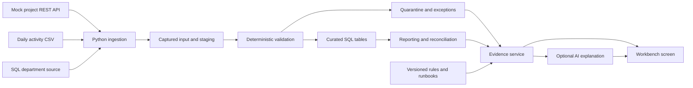

# Data Reconciliation Workbench: implementation plan

Date: 2026-09-28; status reviewed: 2026-10-02

Status: P01-P08, including P05A, are complete. On October 2, 2026, the user confirmed all runs after P03 green, including P08 commit `c7776e8`. Exact P08 run artifacts have not been inspected here and the checked-in screenshots remain labeled previews. P09 is implemented and locally SQL-verified: migration 008 applied, all 338 tests passed (52 SQL cases, no skips), and the real SQL/browser walkthrough passed. GitHub CI acceptance remains pending. P09 provides screen investigations, frozen context/citations, selected runbooks, structured sections, and bounded optional AI with offline fallback. See [P09 validation](p09-validation.md), [local SQL evidence](evidence/p09-local/README.md), and the [investigation guide](investigations.md). Retain the original 120-160-hour planning budget.

### How to read the plan

- **P01 through P12 are project work-package IDs.** P05A is a small additional package immediately after P05, bringing the total to 13. For example, P01 is environment setup, P02 is data contracts and fixtures, and P03 is database schema, migrations, and SQL Server CI. The complete list, dependencies, estimates, and completion criteria appear in [Section 6: Work packages](#6-ordered-backlog-and-completion-gates).
- **The P labels identify work packages, not priority levels.** This plan does not define P0/P1 priorities or a P00 package. Use the full ID, such as P01, when referring to a package.
- **Milestones 1 through 5 group related work packages** into demonstrable outcomes. For example, milestone 1 (Foundation) contains P01, P02, and P03.
- **S01 through S12 are test-scenario IDs**, defined in [Section 7: Scenario and test matrix](#7-scenario-and-test-matrix).

## 1. Outcome

Build a small operational application that ingests synthetic research project data, explains why reported activity differs from source data, and proves that corrections and reruns are safe.

The primary review path is a clear README, screenshots, and a short recording, supported by working code. A reviewer should understand the problem and result without installing anything. Docker Compose provides the optional run-it-yourself path and demonstrates containerization, service readiness, networking, and persistent storage alongside Python ingestion and SQL Server engineering. Code computes every count and validation result; AI explains recorded evidence.

Begin the demonstration materials when the command-line workflow works, then update them as the screen and assistant become available. Record observed results and limitations rather than describing planned features as complete.

Follow the [demonstration storyboard](demo-guide.md) for the screenshot checklist, README order, and recording sequence. A hosted interactive demo is optional; it is not required for the first portfolio release.

**First working demonstration (P05):** load all three sources, produce a known discrepancy, record its exact causes, and rerun without changing counts. Immediately afterward, P05A adds an offline explanation stub and one real provider call for that discrepancy, before work begins on the screen.

## 2. Release scope

Deliver one repository, one SQL Server database, one workbench screen, and one evidence-based investigation assistant.

Included:

- Synthetic project registry REST API, daily activity CSV, and departmental reference SQL table.
- Versioned data contracts, authoritative-field mapping, fixed validation rules with metadata parameters.
- Immutable captured input, staging, curated records, quarantine, reporting views, load history, and audit events.
- Exceptions for duplicates, missing values, unknown references, stale feeds, and reconciliation differences.
- Analyst investigation, operator-triggered loads, source correction followed by rerun, and recovery documentation.
- Twelve reproducible scenarios, automated checks against real SQL Server, and a short demonstration script.
- A bounded assistant that cites recorded evidence, introduced first as a small CLI feature. The application remains functional with AI disabled.

Deferred: production deployment, institutional integrations, patient or employee data, enterprise SSO, a configurable rules language, arbitrary SQL chat, vector database, autonomous repairs, multiple UI pages, temporal tables, finance/access variants, and a second application language. These require separate scope decisions after the first release.

Also deferred: simultaneous ingestion workers and concurrency stress tests, migration checksum drift detection, a queryable history of reference-data versions, and automatic or manual re-evaluation of historical dates following reference changes. The first release uses a fixed reference fixture set per demo database and a single ingestion worker. Retain load evidence and atomic publication; these are central to the demonstration.

## 3. Architecture and technical defaults

| Component | Default | Purpose |
|---|---|---|
| Runtime | Python 3.12 with uv-locked dependencies | Ingestion, API, validation, and tests share one runtime |
| Web application | FastAPI with Jinja templates and small amounts of JavaScript | One screen with summary, exception list, and investigation panel |
| Persistence | SQL Server 2022 Developer container, pinned by digest | Same database image for Compose demonstrations and CI |
| Database access | Test `mssql-python` in P01; use `pyodbc` if compatibility blocks progress | Parameterized SQL and explicit transactions; select and maintain one driver |
| Schema changes | Numbered T-SQL migrations with applied-version ledger | Repeatable empty-database setup; checksum drift detection deferred |
| Pipeline entry point | Python CLI calling application services | Same ingestion behavior for CLI and operator action |
| Source simulation | Separate mock API process, fixture CSVs, `source.Department` table | Demonstrate three integration patterns within one repository/database |
| Tests | pytest and SQL driver CI scaffold from P01; schema tests in P03; browser smoke test when the UI exists | Verify database behavior throughout implementation |
| Assistant | Small provider adapter plus deterministic offline stub from P05A | Start with one fixed discrepancy question; broaden in P09-P10 |

FastAPI documents server-rendered templates, and Microsoft's Python driver exposes DB-API access to SQL Server. These fit the proposed thin application without requiring a separate front-end build. See [FastAPI templates](https://fastapi.tiangolo.com/advanced/templates/) and [Microsoft's Python driver documentation](https://learn.microsoft.com/en-us/sql/connect/python/mssql-python/python-sql-driver-mssql-python?view=sql-server-ver17).

Docker Compose is the default development and demonstration setup. On Windows, use Docker Desktop with Linux containers on supported x86-64 hardware. Native SQL Server installation is optional. The database remains on the Compose network; publish the application's web port when the screen is implemented. Use a named database volume for development and a disposable volume in CI.

P01 tests connection, parameter binding, Unicode, commit, and rollback using the selected driver. Timebox compatibility troubleshooting; if necessary switch to `pyodbc` with the Microsoft ODBC driver and repeat the same checks. Document the working version combination rather than maintaining two runtime implementations. See the [pyodbc Windows connection guide](https://github.com/mkleehammer/pyodbc/wiki/Connecting-to-SQL-Server-from-Windows).

P01 adds `docker-compose.yml`, a Python Dockerfile, and a GitHub Actions workflow: a pinned SQL Server image, health/readiness checks, persistent development storage, and externally supplied credentials. An Ubuntu x86-64 runner builds the images and executes driver health/transaction tests against a disposable database. P03 extends this with migrations, relational constraints, and schema integration checks. Grow the suite with every package. GitHub requires Linux runners for service containers; SQL Server's container support is Linux x86-64. See [GitHub Actions container requirements](https://docs.github.com/en/actions/reference/workflows-and-actions/workflow-syntax) and [SQL Server container setup](https://learn.microsoft.com/en-us/sql/linux/install-upgrade/quickstart-install-docker?view=sql-server-ver17).

The P01 application container runs one-shot CLI checks. Extend Compose with the mock API and web process as those components are implemented. The release gate is a tested clone/configure/start/seed/demo workflow, not merely a checked-in Compose file. Initial Compose/CI work moves from P03 into P01; the combined foundation estimate is unchanged. Actions verifies the project; a running Codespace can optionally provide a remote browser demonstration later. Screenshots and recording remain the primary review path.



All writes pass through application services. The assistant receives a bounded evidence packet; it has no database credentials, SQL execution tool, or repair tool.

## 4. Data contracts and ownership

Use fictional departments and projects. Initial demonstration size: 5 departments, 25 projects, and 100 activity rows. Generate a separate larger fixture for the SQL tuning exercise.

P02's versioned contracts, authoritative-field mapping, fixed rule IDs, source artifacts, and independent expected results are documented in [source-contracts.md](source-contracts.md). The checked-in fixture generator recreates the source artifacts without reading or rewriting expected results.

| Source | Required fields | Grain / key | Authority |
|---|---|---|---|
| Department SQL table | `department_id`, `department_name`, `is_active` | One department per ID | Department name and active state |
| Project REST snapshot | `project_id`, `project_name`, `department_id`, `project_status`, `updated_at` | One project per ID in a captured snapshot | Project identity, name, department assignment, and status |
| Daily activity CSV | `activity_id`, `project_id`, `activity_date`, `activity_status`, `completed_units`, `source_updated_at` | One activity per ID within a business date | Activity status and units |

Contract defaults:

- Each CSV is a complete replacement snapshot for exactly one business date; delta feeds are deferred. A sidecar manifest supplies business date, export timestamp, declared row count, and schema version so a valid empty day is distinguishable from a missing file.
- Activity identity is `(activity_date, activity_id)`. Reject mixed-date files. IDs are trimmed and case-normalized according to a documented contract before comparison.
- Business dates use `America/New_York`; timestamps are stored in UTC. Freshness compares expected delivery deadlines with a supplied clock, so tests do not depend on the real date.
- Activity status is an explicit allowed set, initially `planned`, `completed`, and `cancelled`. `completed_units` is a nonnegative integer; completed activities require a positive value, and other statuses require zero.
- Start with completed-activity counts and completed-unit totals. Monetary arithmetic belongs to a later finance variant.
- Load departments, then projects, then activities. A missing or failed dependency blocks activity publication; do not silently treat an unavailable reference feed as an empty valid feed.
- Keep department/project reference fixtures fixed for each demo database; changes require a fresh isolated demo database. Store the fixture-set ID/hash on each load and the reference facts used in each finding. Preserve captured input for evidence, but defer reference-version tables, as-of queries, and historical re-evaluation. Explain old findings from saved evidence rather than recomputing them against current data.
- Source schema failures, malformed CSV structure, manifest count mismatch, or incomplete API pagination fail the whole load. Row-level validation failures quarantine individual rows and permit valid rows to publish with warnings.

### Proposed SQL organization

| Schema | Initial objects | Responsibility |
|---|---|---|
| `source` | `Department` | Mock authoritative SQL input, changed only by fixture/source operations |
| `meta` | `SchemaMigration` | Applied migration versions; contracts, mappings, and rule parameters live in version-controlled files |
| `ops` | `Load`, `InputArtifact`, `Exception`, `ReconciliationResult`, `AuditEvent`, `Investigation` | One Load row per attempt, provenance, findings, saved evidence, and actor history |
| `stg` | `SourceRow` | Common raw-row envelope: source, payload, ordinal, hash, load ID, and disposition |
| `core` | `Department`, `Project`, `Activity` | Current curated entities with unique keys, foreign keys, and originating load/row links |
| `report` | `vw_ProjectActivity`, `vw_LoadReconciliation`, `vw_OpenExceptions` | Operator-facing counts and drill-downs |

Quarantine is a durable disposition of a staged row plus its validation findings; it need not duplicate the raw payload in another table. An invalid row may have multiple findings but contributes to excluded counts only once.

This is a 12-table target plus three views, created incrementally. P03 establishes the migration ledger, load/input/staging objects, and typed curated tables; later packages add findings, reconciliation, audit, and investigation objects as needed. Shared staging holds raw payloads; curated entities retain typed columns, relational keys, and constraints.

P03's initial eight tables and three migrations are documented in the [database schema guide](database-schema.md). The Compose `migrate` service uses administrator access for setup; the regular application service uses the separate `workbench_app` login. P05 populates the report schema with two views; P06 adds the third, `vw_OpenExceptions`.

P04 adds migration 004's identifier correction and migration 005's `Exception` and `AuditEvent` tables, bringing the implementation to ten tables. Its adapters, row rules, publication transactions, and CLI commands are described in the [ingestion guide](ingestion.md). P05 adds migration 006 with persisted reconciliation, saved evidence, and two reporting views, bringing the implementation to eleven tables. These changes passed SQL CI. P06 migration 007 adds lifecycle columns and the open-exceptions view, accepted on user-confirmed green CI; P08 verifies permissions/audit coverage across the UI actions.

Keep infrastructure names generic (`SourceRow`, `Load`, `Exception`, evidence services). Keep research-domain tables explicit (`Project`, `Activity`) rather than creating a generic entity framework. A later access-reconciliation variant can reuse ingestion, evidence, UI, and assistant components, but requires its own domain contracts, curated schema, and rules; it is not assumed to be only a fixture swap.

### Load identity, publication, and correction

1. Assign each captured source artifact a content hash and store its raw content, metadata, and row identity. Small synthetic inputs can be stored in the database to simplify reproducibility and restore.
2. Identify a logical evaluation by source, business date/snapshot, artifact hash, contract/rule version, and fixed reference fixture-set hash. Record every attempt as a Load row. Repeating an already successful evaluation is a documented no-op linked to the prior published load, with an audit event.
3. Support one ingestion worker and serialize requests through it; CLI and web actions use the same execution path. Retain database unique constraints. Multi-worker coordination and simultaneous-rerun tests are deferred; document the single-worker limitation.
4. Capture and validate before publication. Commit curated replacement, reconciliation results, publication state, and related exception updates in one transaction. On failure, roll back publication and separately record the failed attempt.
5. Only successfully published loads feed reporting. A row-invalid snapshot may publish its valid subset as `published_with_exceptions`; the UI must clearly show its data quality state. A structurally invalid snapshot leaves the prior published partition visible with a failed-refresh warning.
6. A corrected CSV has a new hash. Atomically replace that business-date partition, including removing records absent from the replacement; never append a corrected snapshot to the prior snapshot.
7. Preserve old staged rows, rule versions, reconciliation results, and exceptions. Resolve old findings only when a successful successor evaluation demonstrates resolution; link the successor. Manual acknowledgement does not mean repaired.
8. Reject a changed reference fixture-set hash within an existing demo database with a clear fresh-database instruction. Retain historical results and finding evidence; reference change propagation is outside the first release.

### Reconciliation definition

For each successfully evaluated activity snapshot, every raw row receives exactly one accounting disposition: accepted, excluded duplicate, or excluded invalid. Store additional rule findings separately.

`raw rows = accepted rows + excluded duplicate rows + excluded invalid rows`

For rows declaring completed status:

`source completed count - curated completed count = excluded completed rows`

Group excluded completed rows by their single primary exclusion reason to avoid double counting. Reconcile completed units with the same accounting rule when values parse; label source totals incomplete when invalid numeric values prevent a trustworthy total. Distinguish unknown values from zero. Reporting filters, business date, publication ID, and reference fixture-set hash must match the comparison.

Exact duplicate rows retain the first occurrence by captured row ordinal and exclude later copies. Conflicting rows with the same business key quarantine the entire conflicting group, so arrival order cannot choose an authoritative value.

Golden discrepancy: 100 rows all declare completed status; 2 are extra exact duplicates, 3 reference unknown projects, and 1 lacks a required project ID. The published report contains 94 completed activities, with all 6 exclusions explained. After removing the duplicate extras and fixing the other 4 rows, the corrected source and curated report both contain 98 activities. Expected values are fixture-owned assertions, independently specified from pipeline output.

## 5. Operator workflow and assistant boundary

The single workbench screen contains a business-date/load selector, freshness and load status, source-versus-curated summary, filterable exception table, and a detail panel. Each exception exposes its source row, load, validation rule/version, reference evidence, and linked runbook.

Use two local demo roles with server-enforced permissions: an analyst can inspect evidence and request explanations; an operator can also initiate loads/reruns and acknowledge findings. Use explicit local demo identities bound to a server session, label this mode, bind the demo to localhost, and test permissions at API endpoints. Enterprise identity integration is deferred; a client-supplied role or hidden UI button is not access control.

Record actor, action, timestamp, target load/exception, and reason for operator actions. Keep schema-migration credentials separate from runtime access; the explanation component only calls read-only evidence services. Protect mutation endpoints against cross-site requests and escape source content in the UI.

Keep browser-write protection small: use POST for mutations, session-bound CSRF tokens with server validation, and SameSite session cookies. Localhost binding alone does not establish that a request originated in this application. Implement these checks with the first write endpoints, then verify them in P08. See [OWASP CSRF prevention guidance](https://cheatsheetseries.owasp.org/cheatsheets/Cross-Site_Request_Forgery_Prevention_Cheat_Sheet.html).

The assistant receives:

- The selected load/exception and deterministic totals, dispositions, and freshness observations.
- Stable evidence IDs and authorized evidence links.
- Applicable versioned rule definitions, field ownership, and a small runbook set selected by rule ID.

Its response separates **confirmed facts**, **possible causes**, **missing evidence**, and **suggested next checks**. It may draft an incident summary. It cannot claim a repair or successful rerun without a recorded event. Source text is untrusted data, never instruction.

Reject citation IDs absent from the supplied evidence packet. Bound context size, response length, timeout, retries, and per-request spend. Log provider/model, prompt version, evidence IDs, latency, and outcome without secrets. With the provider unavailable, show the same deterministic evidence and runbook guidance with an explicit unavailable state.

P05A implements only a CLI explanation of the golden discrepancy, using the same saved evidence packet for an offline stub and one real provider call. Include citation checks, a timeout/output cap, and an unavailable state immediately. Label stub output as a stub. Manually verify the live answer against the six exclusions and retain a sanitized example. P09 adds screen integration, runbook selection, and persisted investigations; P10 adds the broader evaluation suite.

## 6. Ordered backlog and completion gates

### Work-package definitions: P01 through P12, plus P05A

Each P ID identifies the work described in its table row. **Depends on** lists the packages that must meet their acceptance gates before that package begins. **Acceptance gate** defines the evidence required to call the package complete. Estimates include implementation, relevant tests, and documentation.

Start with **P01: Verify environment and scaffold project**. The preferred sequence is P01-P05, P05A, then P06-P08. P05A is the early AI slice added without renumbering the existing packages; P06 technically depends on P05 so unavailable provider access need not block the screen. After P08, expanded AI work (P09-P10) and recovery/performance work (P11) can be scheduled independently, with P09 also requiring P05A. P12 requires both P10 and P11 to be complete.

Estimates assume one developer familiar with Python/SQL, synthetic data, and local delivery. Each row is intended to become one small issue or pull request; split a row if necessary. Implementation includes its relevant tests and documentation.

| Work-package ID | Work package | Depends on | Estimate | Acceptance gate |
|---|---|---|---|---|
| P01 | Scaffold Python, Docker Compose, and driver checks | None | 8-12 h | Images build and Compose SQL becomes healthy; selected driver passes connection, parameter, Unicode, commit/rollback checks; locked dependencies, safe `.env.example`, health command, lint/test runner, and initial GitHub Actions workflow |
| P02 | Specify contracts and seed fixtures | P01 | 6-8 h | All three sources reproducible; manifests, field mapping, rule IDs, and golden expected results checked in |
| P03 | Build initial schema and migrations; extend SQL Server CI | P02 | 10-12 h | Empty database migrates; applied versions prevent reapplication; keys/FKs verified; existing Compose/Ubuntu CI runs migrations and schema integration tests |
| P04 | Implement ingestion, validation, quarantine, and publication | P03 | 20-30 h | Three adapters work; known invalid rows have evidence; sequential identical rerun is a no-op; corrected snapshot replaces its partition; injected failure cannot partially publish; checks run in existing CI |
| P05 | Implement reconciliation, CLI demo, and first demo materials | P04 | 8-10 h | Golden 100-to-94 discrepancy and corrected 98-to-98 result pass; repeat unchanged; saved evidence packet available; README explains the workflow with terminal screenshots and a short recording |
| P05A | Add the first AI explanation | P05 | 4-6 h | Offline stub and one real provider call explain the golden discrepancy from saved evidence; citations/counts checked; timeout and unavailable state work; README links a sanitized example |
| P06 | Build evidence API and exception lifecycle | P05 | 8-10 h | Reuse the saved evidence packet also used by P05A; endpoints return stable evidence; historical findings retained; successor resolution and acknowledgement distinct; new mutations protected when introduced |
| P07 | Build one-screen operator workflow | P06 | 8-12 h | User can filter, inspect, initiate an allowed rerun, and see load/freshness states; README and recording updated with actual UI screenshots |
| P08 | Complete role enforcement and audit coverage | P07 | 6-8 h | Analyst mutation requests denied; operator actions attributable; cross-site mutation checks verified; source content escaped; assistant has no write path |
| P09 | Expand AI investigation in the screen | P08, P05A | 8-10 h | Extend P05A with runbook selection, structured answer sections, persisted investigations, and screen integration; preserve citation checks and offline behavior |
| P10 | Run assistant evaluation and failure tests | P09 | 6-8 h | Seeded questions supported by citations; missing evidence acknowledged; injection and fabricated-repair cases fail safely |
| P11 | Prove recovery and SQL performance | P08 | 8-12 h | Interrupted-load recovery and backup/restore rehearsed; query plan and before/after logical reads recorded; recovery checks extend the existing SQL CI suite |
| P12 | Finish release demonstration and engineering documentation | P10, P11 | 8-10 h | Clean Compose setup replay; README leads with screenshots and a 5-7 minute recording; schema diagram, dictionary, runbooks, and limitations complete |

Work-package subtotal: **108-148 focused hours**. Reserve **12 additional hours** for setup/integration rework, giving a planning budget of **120-160 hours**, approximately **8-11 weeks at 15 hours/week**. These are estimates for the trimmed release, not a fixed-price commitment; re-estimate after P03 and P05. No external deadline or staffing commitment is assumed.

**P05 checkpoint (October 1, 2026; superseded by the P05A checkpoint below):** SQL acceptance and demonstration evidence are complete. The unchanged estimates for P05A and P06-P12 sum to **56-76 focused hours**, excluding any unused contingency. No elapsed-effort record is available, so this is a remaining-scope estimate rather than measured budget consumption. The saved evidence packet is ready for the first AI slice; provider access, screen integration, and recovery/performance work remain the main uncertainties. Reassess after P05A.

**P05A checkpoint (October 1, 2026):** The first live explanation passed count/citation checks and manual review; the offline stub and failure paths are tested. See [P05A validation](p05a-validation.md). Remaining P06-P12 estimates total **52-70 focused hours**, excluding unused contingency. The user confirmed P05A CI green for commit `59091f3`, clearing the remaining verification checkpoint. The next package is P06.

### Milestones: groups of completed work packages

**P06 checkpoint (October 1, 2026; superseded below):** user-confirmed green CI cleared P07. Remaining P07-P12 estimates totaled **44-60 focused hours**, excluding contingency and without a measured elapsed-effort claim.

**P07 checkpoint (October 1, 2026):** user-confirmed green CI for `9c98633` clears P08. Remaining P08-P12 estimates total **36-48 focused hours**, excluding contingency; no elapsed-effort measurement is implied. P08 was locally implemented at this checkpoint; its gate was subsequently cleared as recorded below.

**P08 checkpoint (October 2, 2026):** user-confirmed green CI for the runs after P03, including P08 commit `c7776e8`, completes the usable-workbench milestone. P09 is next; P11 can also proceed independently. Remaining P09-P12 estimates total **30-40 focused hours**, excluding contingency and without a measured elapsed-effort claim.

**P09 local implementation (October 2, 2026):** the screen now saves immutable investigation artifacts with the original packet, dated observations, selected runbooks, exact report facts, and optional model notes. Both roles may create investigation artifacts; ingestion and acknowledgement remain operator-only. P09 supports saved publications, including clean/incomplete reports and no-op reuse; failed attempts without saved reconciliation retain the existing inspector. Full acceptance awaits green SQL/browser CI. P10-P12 retain their original **22-30 focused hours** of estimates after this gate; no actual-effort measurement or P10 model-evaluation completion is implied.

**P09 local SQL checkpoint (October 2, 2026):** Docker Desktop was installed and started. The `workbench` database was created with migrations 001–008; repeated setup applied nothing. All **338 tests passed**, including **52 SQL cases with no skips**. The live SQL CLI demonstration, API inspection, and browser journey also passed. The API was restored to the populated main database and left healthy. This clears the local environment blocker; GitHub CI and P10's expanded live-model evaluation remain separate gates.

1. **Foundation (P01-P03, 24-32 h):** reproducible sources, migrated database, Compose setup, and SQL Server CI.
2. **First demonstrable story (P04-P05A, 32-46 h):** CLI proof, initial README/screenshots/recording, and a real AI explanation of the golden discrepancy.
3. **Usable workbench (P06-P08, 22-30 h):** screen-based investigation and correction workflow; the early CLI AI slice remains available.
4. **Expanded AI investigation (P09-P10, 14-18 h):** screen integration, runbooks, and broader evaluation results.
5. **Release evidence (P11-P12, 16-22 h):** recoverable, documented, reproducible release. P11 can precede expanded AI work after P08. The 12-hour contingency sits outside milestone estimates.

If time is constrained, stop feature expansion after milestone 3, complete P11, and produce a reduced P12 package showing the screen plus the P05A CLI explanation. Label the AI scope as the single evaluated example; do not claim the broader P10 evaluation is complete. Preserve publication safety, exact reconciliation, and recovery; reduce styling and expanded AI features first. If provider access is unavailable, continue independent implementation, but keep P05A's live-call gate outstanding and label any recording as stub-only.

Demonstration materials are maintained deliverables: P05 introduces the story and terminal proof, P05A adds the AI example, P07 adds UI screenshots, and P12 edits these into the final 5-7 minute recording. The README should let a reviewer understand the problem, evidence, architecture, and limitations without running the application.

## 7. Scenario and test matrix

| Scenario | Deterministic expected behavior | Assistant expectation where applicable |
|---|---|---|
| S01 Clean input | Every valid row publishes; zero unexplained difference | Report agreement without inventing an incident |
| S02 Exact duplicate | Later copy excluded; original accepted once | Cite key, both rows, and duplicate rule |
| S03 Conflicting duplicate | Entire conflicting key group quarantined | Explain conflict without choosing an unsupported winner |
| S04 Unknown project | Activity quarantined with captured registry evidence | Distinguish absent reference from a proven source-system cause |
| S05 Missing required value | Row excluded with field/rule evidence | Identify missing value and correction location |
| S06 Invalid status or units | Row excluded; uncomputable totals labeled incomplete | Avoid fabricated numeric totals |
| S07 Unknown department in project registry | Invalid project excluded; dependent activity validation records the missing valid project | Explain dependency through both captured source records |
| S08 Late or missing daily feed | Freshness exception at configured deadline; prior data visibly dated | Distinguish old data from confirmed ingestion failure |
| S09 Sequential identical rerun | One published result; no duplicate facts/findings; attempts auditable | Describe no-op only when recorded |
| S10 Corrected replacement snapshot | Partition replaced atomically; removed rows disappear; history retained | Cite successor publication and verified resolution |
| S11 Failure mid-publication | Rollback retains prior publication; retry yields exactly one result | Never claim failed attempt changed the report |
| S12 Manifest/schema/API completeness failure | Whole load fails; previous publication retained | State incomplete evidence and failed-refresh status |

Additional cross-cutting checks: golden composite discrepancy; changed reference fixture-set rejected with a fresh-database instruction; multiple findings on one row counted once; permissions and cross-site mutation rejection; tampered evidence IDs; source-text prompt injection; unavailable LLM; and missing evidence. Use a fixed clock for deadlines and deterministic fixture IDs. Concurrent-rerun and historical reference re-evaluation tests are deferred with their features.

Unit tests cover configuration and then rule behavior/accounting invariants. SQL Server driver tests start in P01; P03 adds constraints and migrations, and later packages add sequential reruns, replacement, and views. SQLite is not a substitute for these tests. A browser smoke test covers inspect, investigate, correct via source fixture, rerun, and verified resolution. Unit-only local runs clearly report SQL tests as skipped; they do not satisfy the live SQL acceptance gate.

At P05A, check the golden prompt's real answer against the saved evidence and independently specified counts; verify timeout, unavailable-provider, and bad-citation handling with deterministic tests. At P10, create a versioned evaluation set mapped to the scenarios. Run each prompt three times against the selected provider/model and record results. Require all referenced evidence IDs to resolve, all asserted counts to match supplied facts, and zero unsupported repair claims or executed instructions from source data. Review causal assertions manually against the evidence; do not rely solely on a model judge. A failing case blocks the expanded assistant release, not the deterministic workbench. Live provider calls are separate from ordinary CI; CI uses the stub.

Performance exercise: generate 100,000 synthetic activities; select a representative date/exception query; record hardware, query plan, elapsed time, and logical reads; add an evidence-driven index and compare. Proposed local UI target is under 2 seconds for the initial filtered view, excluding AI. Treat this as a benchmark to measure, not an achieved result.

## 8. Proposed repository layout

```text
Dockerfile            # Python runtime and test targets
docker-compose.yml    # Database and CLI first; mock API/web added as implemented
.github/workflows/ci.yml
config/               # Versioned source contracts, mappings, rule parameters
src/workbench/
  config.py
  cli.py
  api/                # Endpoints, server sessions, permission enforcement
  sources/            # REST, CSV, and SQL adapters
  ingestion/          # Capture, validation, publication, reruns
  reconciliation/     # Deterministic comparisons
  evidence/           # Bounded evidence packets and references
  assistant/          # Provider adapter, prompts, citation checks
  db/                 # Connection and parameterized query modules
  templates/
  static/
mock_sources/         # Registry API and source update utilities
sql/migrations/
sql/queries/
fixtures/             # Synthetic inputs, manifests, expected outputs
tests/unit/
tests/integration/
tests/e2e/
evals/
docs/                 # Plan, architecture, dictionary, runbooks, demo
scripts/              # Setup, database lifecycle, and demo helpers
```

The foundation, contracts, fixtures, mock source API, ingestion pipeline, reconciliation, saved evidence, and CLI demonstration are implemented and verified. P05A supplies the checked CLI assistant; P06's evidence API/lifecycle CI is user-confirmed green. P07's screen lives in `src/workbench/static/` and is served by `api.py`; P07 CI is user-confirmed green. P08 adds the audit panel and verification, accepted on user-confirmed green CI. Static HTML and small JavaScript use the existing JSON API without adding a template runtime. The mock API lives in `src/workbench/mock_registry.py`, and the generator in `src/workbench/fixtures.py`. Keep credentials, generated runs, and local environments out of version control and Docker build context. Commit only synthetic fixtures and sanitized configuration templates.

## 9. Risks and decision checkpoints

| Risk / decision | Action and timing |
|---|---|
| Container runtime or database setup takes longer than expected | P01 verifies Compose on a supported Docker host and driver behavior in the Python container; the live SQL gate remains open until executed successfully; use pyodbc if the primary driver blocks progress |
| Reconciliation meaning shifts during implementation | P02 locks grain, status definitions, manifests, duplicate policy, accounting equations, and independent expected outputs |
| Reruns corrupt or duplicate curated data | P04 proves unique constraints, single-worker execution, rollback, corrected partition replacement, and attempt history before UI work |
| Reference updates rewrite historical explanations | Freeze reference fixtures per database, reject changed fixture hashes, and preserve original finding evidence; defer reference-history processing |
| AI distracts from the database/application demonstration | Bound P05A to one golden-example explanation; defer general investigation and runbook integration to P09 |
| Model cost or credentials are unavailable | Select provider/model and a small call budget at P05A; continue independent work with a labeled stub, but retain the live-call gate as incomplete |
| Reviewers do not run the application | Start README screenshots and recording at P05; refresh after P05A and P07; prioritize a clear final demonstration |
| Local demo gets mistaken for production readiness | Label synthetic data and demo identities; document deployment, SSO, retention, monitoring, and real-data controls as future work |
| Recovery exists only on paper | P11 restores a backup into a separate demo database and replays an interrupted load; record observed results |

Implementation owner: the project developer. Review checkpoints occur at contract acceptance (P02), SQL CI and estimate review (P03), deterministic demonstration and estimate review (P05), first real AI example (P05A), and release replay (P12). The defaults permit P01 to begin immediately; provider/model selection and deployment decisions do not block it.

## 10. First implementation session

1. Verify Python and Docker availability. Build the Python image, start the Compose SQL Server service, and test driver parameter binding, Unicode, commit, and rollback; switch to pyodbc if needed and record the chosen setup.
2. Add `pyproject.toml`, locked dependencies, the `src/workbench` package, test/lint configuration, and a credential-free `.env.example` without overwriting existing local configuration.
3. Implement a configuration check and database health command with useful, redacted errors.
4. Draft the three versioned source contracts and golden fixture manifest before implementing validation rules.
5. In P01, add the initial Dockerfile, Compose configuration, and CI driver checks. In P03, add numbered migrations for load tracking, migration history, captured artifacts, staging, and curated entities, then exercise them in the existing container/CI workflow.

The first reviewable change proves setup and driver behavior. The next changes establish contracts/fixtures, migrations with SQL Server CI, and ingestion. After the CLI reconciliation proof, capture the first demo materials and add the small AI slice.

## 11. Release definition of done

- A fresh checkout can follow the tested Compose workflow, seed the sources, migrate SQL Server, and run the complete demonstration. A reviewer can also understand the result from the README and recording alone.
- All 12 scenarios and critical accounting/publication invariants pass against SQL Server.
- SQL Server driver checks run in CI from P01, with schema/migration coverage added in P03; no claim of concurrent-worker support is made.
- Every reported discrepancy links to recorded source rows, a load, versioned rules, and saved reference evidence from the fixed fixture set.
- A source correction followed by rerun produces the expected replacement totals and preserves investigation history.
- Role restrictions are enforced on the server and operator writes produce audit records.
- With the LLM disabled, ingestion, validation, reporting, evidence inspection, and reruns remain functional.
- At least one real provider explanation is demonstrated; stub output is clearly labeled. For the full release, the expanded assistant meets the P10 evaluation gate and makes no unsupported repair claims.
- Recovery and tuning claims include reproducible measurements or rehearsal results.
- README leads with the problem, actual screenshots, and a 5-7 minute recording; schema diagram, field ownership dictionary, troubleshooting/recovery runbooks, demonstration walkthrough, and documented scope limits are complete.
