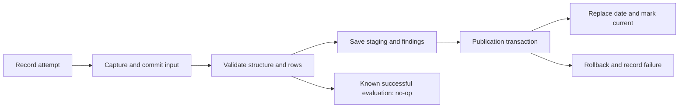

# Ingestion and publication (P04)

The pipeline reads the department SQL table, follows the registry's REST pagination, and parses an activity CSV plus its manifest. It retains captured input, applies the fixed v1 rules, saves every finding, and publishes valid rows. Counts and decisions are deterministic Python/SQL operations. No AI participates in ingestion.

**Verification:** P04 passed 143 tests including all 33 SQL cases, publication rollback, permissions, and the P03 correction. See [P04 verification](p04-validation.md). P05 extends publication with saved reconciliation/evidence; all 38 SQL cases passed in its 164-test suite. See [P05 validation](p05-validation.md) for the accepted walkthrough and retained evidence.

## Run the sources and load a date

Run the [README setup](../README.md#run-the-foundation-with-docker-compose) first. These commands use checked-in synthetic data inside the images and run from the repository root in PowerShell:

```powershell
# Apply pending migrations, including the P03 constraint correction.
docker compose --env-file .env.workbench --profile tools run --build --rm migrate
docker compose --env-file .env.workbench build workbench
docker compose --env-file .env.workbench --profile sources up -d --build --wait mock-registry

# Seeding the authoritative source requires the administrator setup service.
docker compose --env-file .env.workbench --profile tools run --rm migrate seed-departments
$referenceHash = (Get-Content fixtures/generated/index.json -Raw | ConvertFrom-Json).reference_sets.default

# Ingestion uses the restricted application login, in dependency order.
docker compose --env-file .env.workbench run --rm workbench load-departments --reference-hash $referenceHash
docker compose --env-file .env.workbench run --rm workbench load-projects
docker compose --env-file .env.workbench run --rm workbench load-activities --csv fixtures/generated/activity/golden.csv --manifest fixtures/generated/activity/golden.manifest.json

# Identical input records another attempt and returns no_op.
docker compose --env-file .env.workbench run --rm workbench load-activities --csv fixtures/generated/activity/golden.csv --manifest fixtures/generated/activity/golden.manifest.json

# Corrected input replaces the date's curated partition.
docker compose --env-file .env.workbench run --rm workbench load-activities --csv fixtures/generated/activity/corrected.csv --manifest fixtures/generated/activity/corrected.manifest.json

# Read-only freshness observation with the scenario's clock.
docker compose --env-file .env.workbench run --rm workbench freshness --business-date 2026-09-25 --now 2026-09-26T13:00:01Z
```

Expected publication results are 94 accepted, 2 excluded duplicate, and 4 excluded invalid rows for `golden`; `corrected` has 98 accepted rows. The independent golden file specifies accepted units of 189 and 197 respectively. SQL tests verify those values; the CLI currently returns row dispositions, not a reconciliation report. P05 supplies the report, saved evidence packet, and guided recording.

Each admitted load attempt returns a `load_id`. Success is `published`, `published_with_exceptions`, or `no_op`. A failed load returns a safe code and exits with code 5. Invalid command arguments/configuration return 2; SQL connectivity failures return 3; preflight/bootstrap/worker-busy diagnostics return 4. `--actor` records a local operator label (default `cli`); it is not authentication. Server-bound roles arrive in P08.

For native Python development, use `workbench --env-file <explicit-file>` with a reachable SQL endpoint and runtime credentials. Override `--registry-url http://127.0.0.1:8001/projects` when the mock runs outside Compose. Container paths refer to files in the image; rebuild after changing checked-in fixtures, or deliberately mount a local fixture directory read-only. The adapter accepts only an operator-configured HTTP(S) registry endpoint; no URL is taken from source records.

## Capture, validation, and transactions



1. Record the attempt and its start audit event. A database application lock admits one ingestion command at a time; an overlapping request fails fast. There is no worker queue or multi-worker support claim.
2. Commit the captured bytes and metadata. CSV bytes and original manifest bytes are preserved; API response bytes are archived page by page; SQL rows are captured as ordered canonical JSON. A failed API request retains pages already received. An unreadable source can have an empty capture plus a failure event.
3. Reject structural faults before publication. Validate rows and their reference dependencies. Each row gets one disposition and at most one primary reason, while `ops.Exception` preserves all additional findings. Commit staged rows and findings before publication so they survive a later rollback.
4. Compute an evaluation key from source/date, raw input hash, captured metadata (including the manifest), contract/rule versions, and the reference hash. A successful existing key produces a new `no_op` attempt, linked to its prior publication, with an audit event; it does not duplicate staging or curated rows. Replaying an already superseded success is also a no-op and leaves the current partition intact. It is not an undo operation.
5. In one transaction, supersede the previous publication, delete only the selected activity date, insert accepted rows, mark the new load current, and write its publication audit event. A valid empty snapshot deletes the date's rows. On failure, roll back all publication changes and separately record the failed attempt. Failed keys can be retried.

P05 now saves reconciliation and its bounded evidence packet inside the publication transaction; see the [report guide](reconciliation.md). Exception resolution/acknowledgement belongs to P06; P04 retains historical findings without claiming they are resolved. Capture and staging are immutable through the application path; the runtime role cannot update/delete captured artifacts or delete history. Staging/state transition rules remain application-enforced, not a protection against arbitrary direct SQL from a compromised runtime account.

## Fixed reference sets and failure codes

Load departments before projects and projects before activities. The registry adapter verifies its declared reference hash against the actual captured department/project pair. A changed fixture hash or changed previously published reference capture requires a fresh isolated demo database. A reference source's latest failed/interrupted attempt blocks dependent publication even if a previous snapshot remains visible; retry the original reference successfully before loading activities again.

Row findings use the [fixed rule IDs](../config/rules.json). Structural failures include `SRC_SCHEMA`, `SRC_MANIFEST_COUNT`, `SRC_BUSINESS_DATE`, `SRC_PAGINATION`, and `REF_DUPLICATE`. Operational codes are separate: `SOURCE_UNAVAILABLE`, `DEPENDENCY_UNAVAILABLE`, `REFERENCE_CHANGED`, and `LOAD_FAILED`. `WORKER_BUSY` rejects an unadmitted overlapping request. Driver exception text and credentials are excluded from returned results and persisted failure messages.

The demo bounds captures to 10 MiB, 10,000 rows, and 100 API pages, with a 10-second request timeout. It rejects repeated cursors, inconsistent snapshot metadata, incomplete totals, ambiguous JSON keys, malformed CSV records, and unexpected record fields. Retries of transport failures are explicit new load attempts.

## Freshness and recovery limits

`freshness` evaluates the requested business date's deadline at 09:00 America/New_York the following day. Its optional UTC clock makes S08 reproducible. An older date cannot satisfy the requested date; an explicitly published empty date can. When a failed replacement leaves a prior publication for that date, the result includes `failed_refresh: true` alongside availability. A freshness observation is read-only; it does not create findings merely because somebody checks status.

Test-only fault callbacks interrupt publication after deleting the old partition or just before commit. They are not exposed as CLI switches. Recovery after process termination, connection loss during commit, and backup/restore rehearsal remain P11 work; an interrupted attempt can remain `started`, `captured`, or `validated` for later recovery handling. P04's rollback guarantee is exercised by the SQL transaction tests, not inferred from local unit tests.

Run the complete suite on a Docker host:

```powershell
docker compose --env-file .env.workbench --profile test run --build --rm tests
```

The tests use administrator credentials only for isolated database setup and source seeding, then provision and use `workbench_app` for ingestion. They require both configured passwords. `WB_TEST_REGISTRY_URL` defaults to the mock Compose service; direct tests can point it at a separately running registry. No test writes fixture expected results or the configured application's curated tables.

## P06 successor resolution

Migration 007 adds lifecycle state alongside immutable findings. Successful activity publication now records eligible historical resolutions and their audit events in the same transaction as curated replacement and reconciliation; rollback preserves the earlier state. No-op/failed attempts do not close findings. See [lifecycle semantics](evidence-api.md#lifecycle-semantics) for key matching, removal, and conservative unresolved cases. These additions are accepted on user-confirmed [P06 green CI](p06-validation.md). P07 adds the protected screen snapshot path; see the [screen guide](workbench-ui.md).
